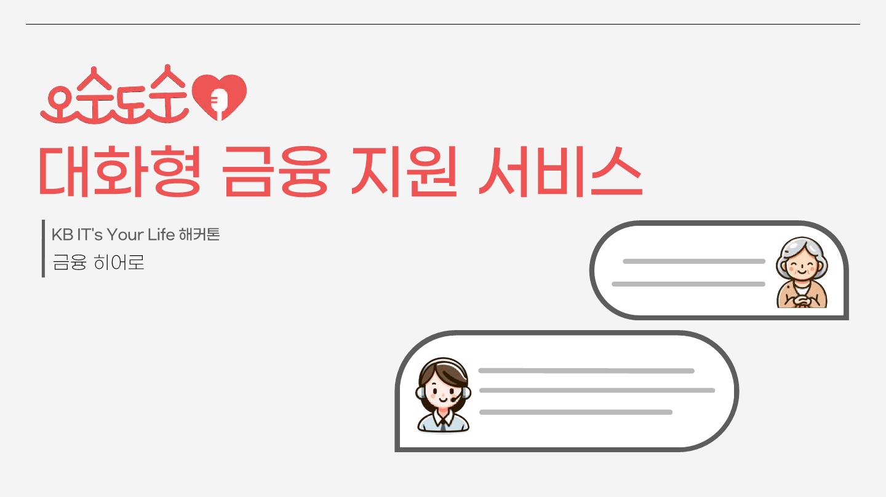
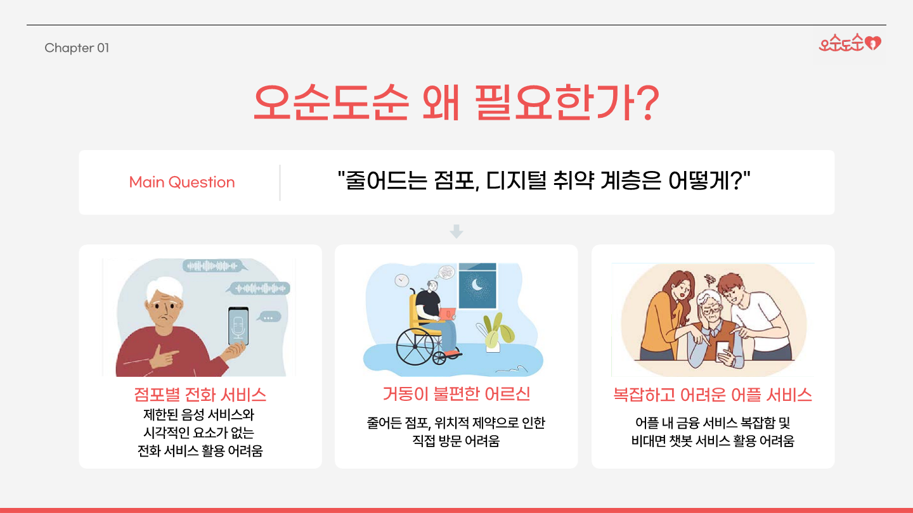
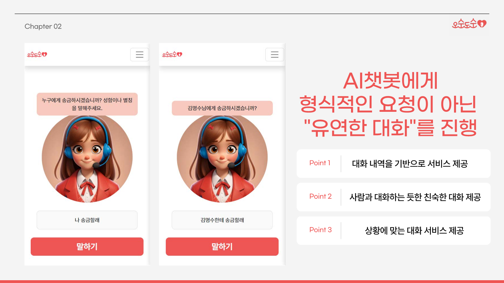
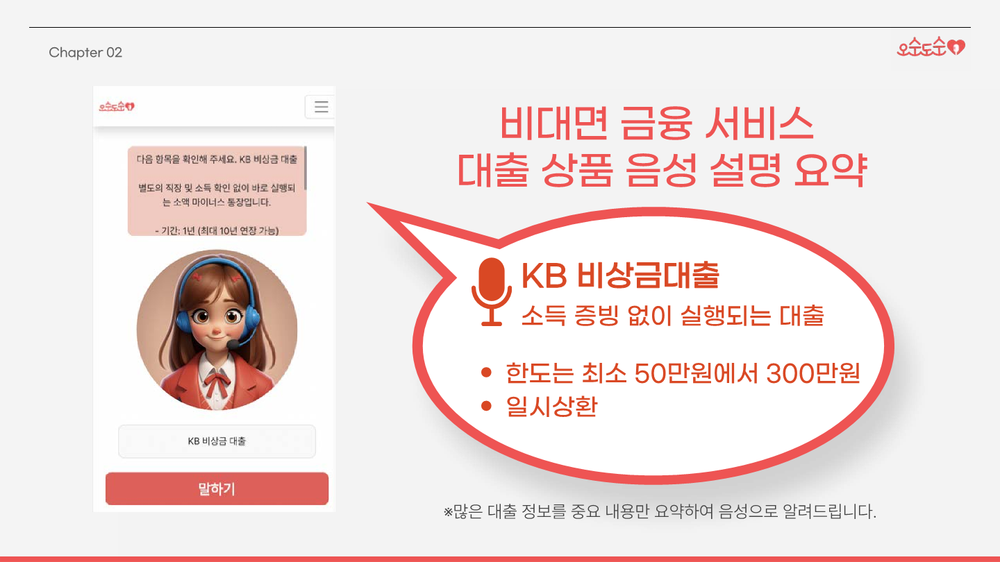
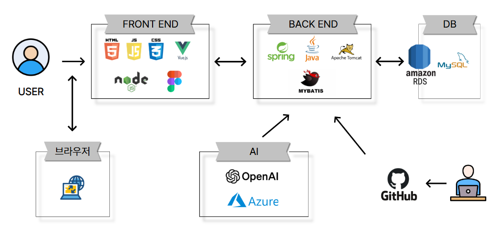

---

## 목차

- [프로젝트 기간](#프로젝트-기간)
- [프로젝트 개요 및 소개](#프로젝트-개요-및-소개)
- [주요 기능](#주요-기능)
- [사용 API](#사용-API)
- [시스템 아키텍처](#시스템-아키텍처)
- [ERD 설계](#erd-설계)
- [팀원 소개](#팀원-소개)

---

## 프로젝트 기간

2024.10.19 ~ 2025.01.02

---

## 프로젝트 개요 및 소개

프로젝트의 주제 : 고령층을 위한 대화형 금융 지원 서비스 
기획 의도 : 고령층의 디지털 소외 문제를 해결하기 위해 고령층도 쉽게 이용할 수 있는 비대면 금융 서비스 앱을 개발하는 것
 

---

# 주요 기능

- 음성 대화를 통한 비대면 금융 서비스
- 대출 상품 음성 설명 요약, 간편 대출 신청
- 가상 계좌를 통한 간편한 송금
- 챗봇 사용이 어려운 이용자를 대상으로 한 상담원 연결
- 입출금 통장 개설 및 통장 재발행
 

---

## 사용 API

---

## 시스템 아키텍처

<h3>Frontend</h3> 

---

## ERD 설계

---

## 팀원 소개

# 오순도순

|  |  |  |  |  |  |
| :------------------------------------------------------: | :----------------------------------------------------------: | :----------------------------------------------------: | :------------------------------------------------: | :-----------------------------------------------------: | :-----------------------------------------------------: |
|         [최종현](https://github.com/jhchoi1104)          |         [박정빈](https://github.com/ParkJeongBin01)          |         [이예본](https://github.com/ybon1107)          |         [정유리](https://github.com/owzl)          |         [이은지](https://github.com/runeunrun)          |         [최윤혁](https://github.com/cyh000127)          |
